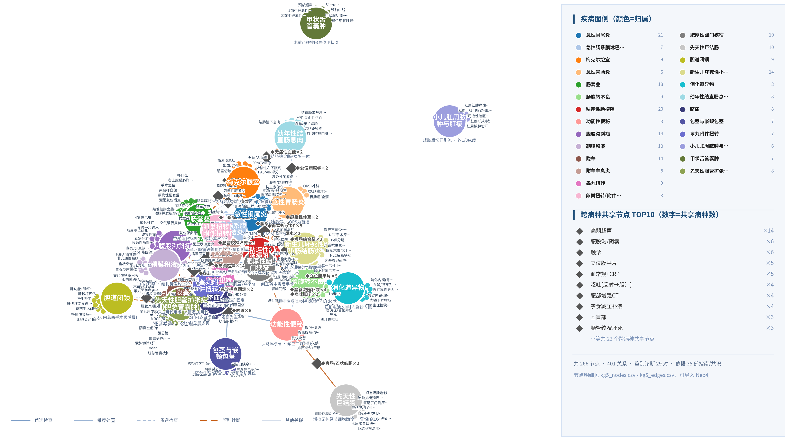
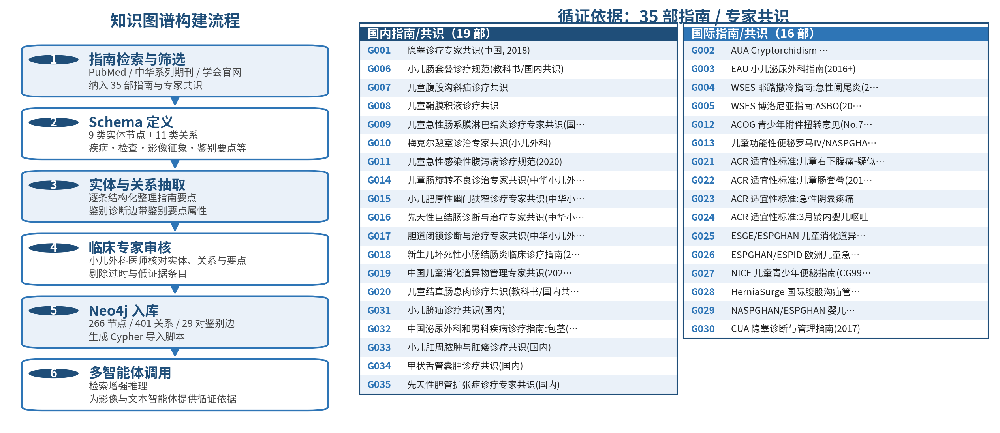

# 小儿外科常见疾病知识图谱（Pediatric Surgery Knowledge Graph）

面向小儿外科临床决策支持系统（CDSS）的循证知识图谱，覆盖 **26 个病种、266 个节点、401 条关系、29 对鉴别诊断边**，全部内容依据 **35 部国内外指南/专家共识**（国内 19 部、国际 16 部）结构化抽取，每条关系均可回溯至具体指南条目。

> ⚕️ 本图谱仅供科研与教学使用，不构成临床诊疗依据。临床使用前请由小儿外科专科医师审核。

## 数据概况（v0.5）

| 指标 | 数值 |
|---|---|
| 病种 | 26（6 个核心病种 + 20 个鉴别诊断扩展病种） |
| 节点 | 266 |
| 关系 | 401 |
| 鉴别诊断边 | 39 条（去重 29 对），均带「鉴别要点」属性 |
| 循证指南 | 35 部（国内 19 / 国际 16） |
| 跨病种共享节点 | 31（如高频超声、血常规等检查被多病种复用） |

**26 个病种**：腹股沟斜疝、急性阑尾炎、肠套叠、鞘膜积液、隐睾、粘连性肠梗阻、急性肠系膜淋巴结炎、梅克尔憩室、急性胃肠炎、睾丸扭转、卵巢扭转(附件扭转)、肠旋转不良、功能性便秘、附睾睾丸炎、肥厚性幽门狭窄、先天性巨结肠、胆道闭锁、新生儿坏死性小肠结肠炎、消化道异物、幼年性结直肠息肉、脐疝、包茎与嵌顿包茎、睾丸附件扭转、小儿肛周脓肿与肛瘘、甲状舌管囊肿、先天性胆管扩张症(胆总管囊肿)。

**11 类关系**：临床表现（41）、影像征象（35）、首选检查（28）、备选检查（29）、推荐处置（46）、鉴别诊断（39）、好发部位（26）、检出手段（31）、分型（20）、并发（36）、证据来源（70）。

## 目录结构

```
data/
  kg_v0.5.json              # 图谱主数据（nodes + edges，UTF-8 JSON）
  neo4j_import_v5.cypher    # Neo4j 导入脚本
  CHANGELOG.md              # 版本修复与核对记录
figures/
  kg5_network_rich.png      # 整合网络图（26 病种着色 + 图例 + 共享节点 TOP10）
  kg_pipeline_v5.png        # 构建流程六步 + 35 部指南清单
scripts/
  build_kg_v5.py            # 图谱构建脚本
  draw_kg_v5_rich.py        # 网络图绘制
  draw_kg_pipeline_v5.py    # 流程+指南图绘制
  export_kg_to_obsidian.py  # 导出为 Obsidian 笔记库（双链 markdown）
```

## 快速使用

**Neo4j 导入**：

```bash
# 在 Neo4j Browser 或 cypher-shell 中执行
cat data/neo4j_import_v5.cypher | cypher-shell -u neo4j -p <password>
```

**Python 读取**：

```python
import json
kg = json.load(open('data/kg_v0.5.json', encoding='utf-8'))
nodes, edges = kg['nodes'], kg['edges']
# 查询急性阑尾炎的鉴别诊断
[d for e in edges if e['relation']=='鉴别诊断' for d in [e] if 'D002' in (e['head'], e['tail'])]
```

**Obsidian 可视化**：运行 `scripts/export_kg_to_obsidian.py` 生成双链笔记库，在 Obsidian 中以图谱视图浏览。

## 网络图预览





## 关联工作

本图谱是「基于动态知识图谱与多智能体协作的小儿外科常见疾病多模态临床决策支持系统」的知识层组件，与 Qwen2.5-VL 融合推理 Agent、TotalSegmenter 影像勾画流水线配合使用。
